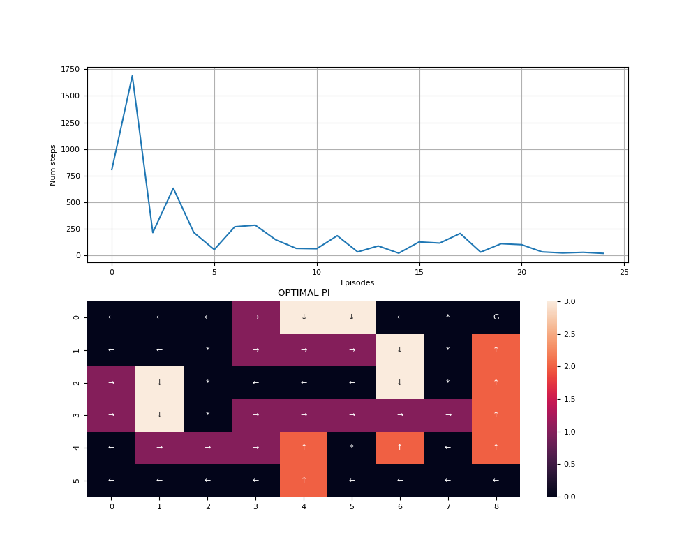
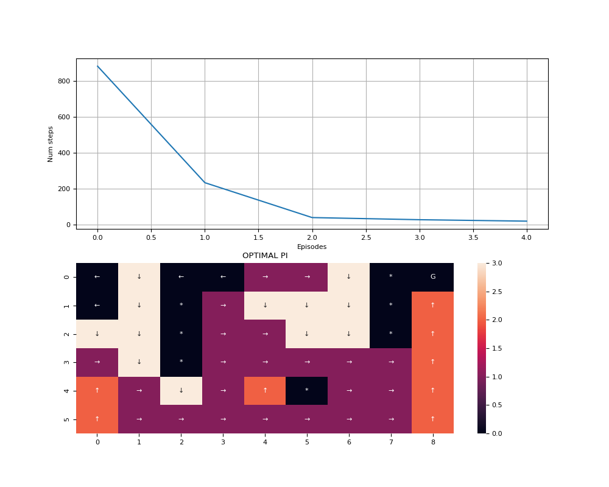
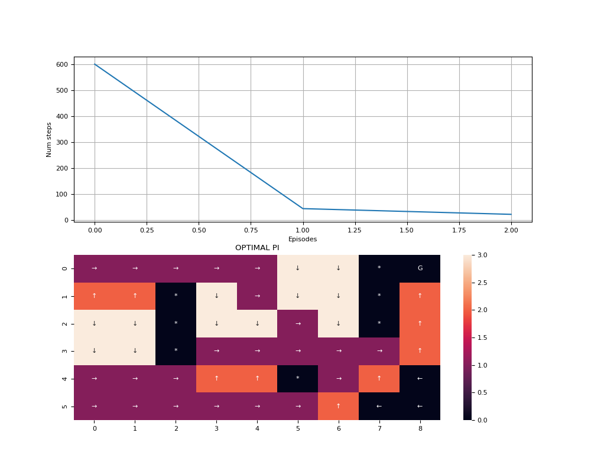

# DYNA-MAZE
- Using _Dyna Q_ to solve the **Control Problem** using example 8.1:
    - Model Learning and Planning (Using Tabular Model for simulating experience).
    - Estimate optimal Q.
    - Estimate optimal policies based on estimated Q.

- Summary:
    - Non-planning agent (n=0) took 25 episodes to converge.
    - 5-step agent took 5 episodes to converge.
    - 50-step agent took 3 episodes to converge.

- Tuning:
    - alpha = 0.1  (Learning rate)
    - gamma = 0.95  (Discounting rate)
    - epsilon = 0.1  (Exploratory rate)

## Examples
- _one-step tabular Q-learning agent_ with 25 episodes:

- _5-step tabular Q-learning agent_ with 5 episodes:

- _50-step tabular Q-learning agent_ with 3 episodes:

## Comparisons:
- Comparing n=0, n=5, n=50:

