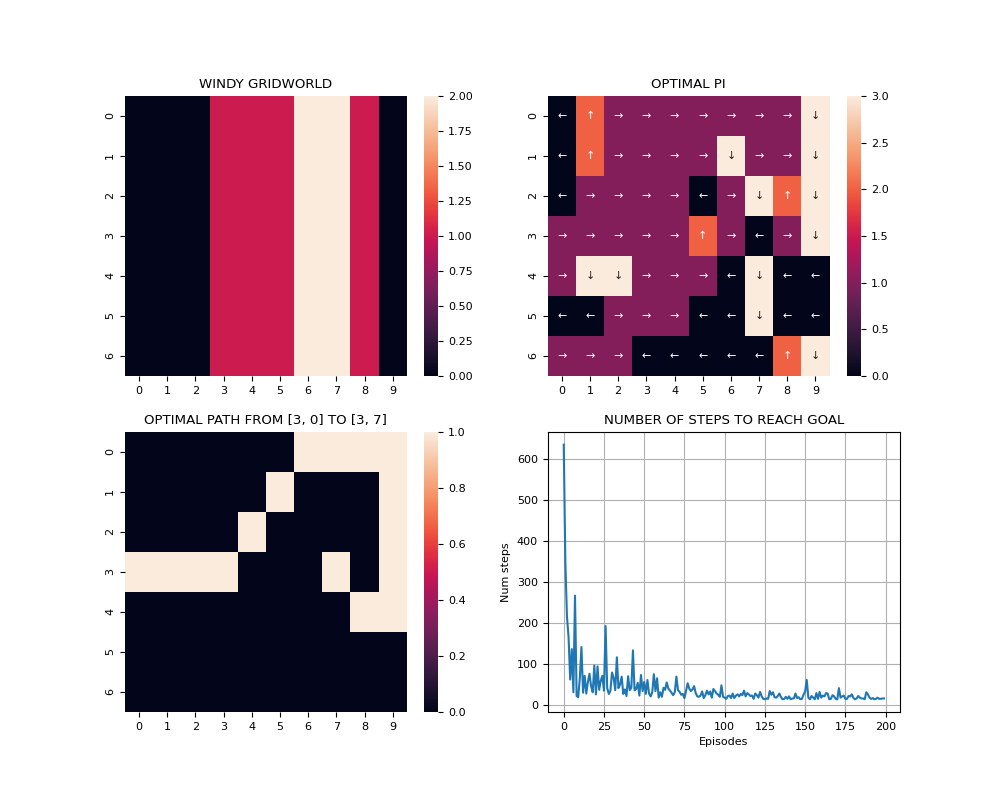
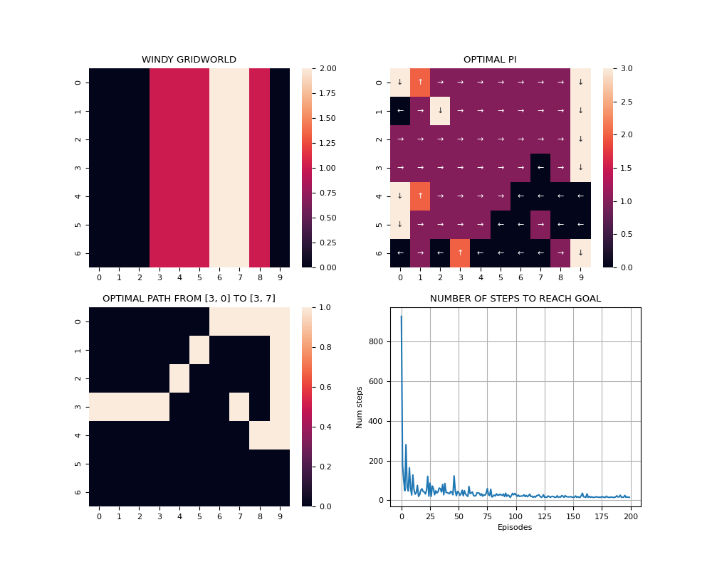
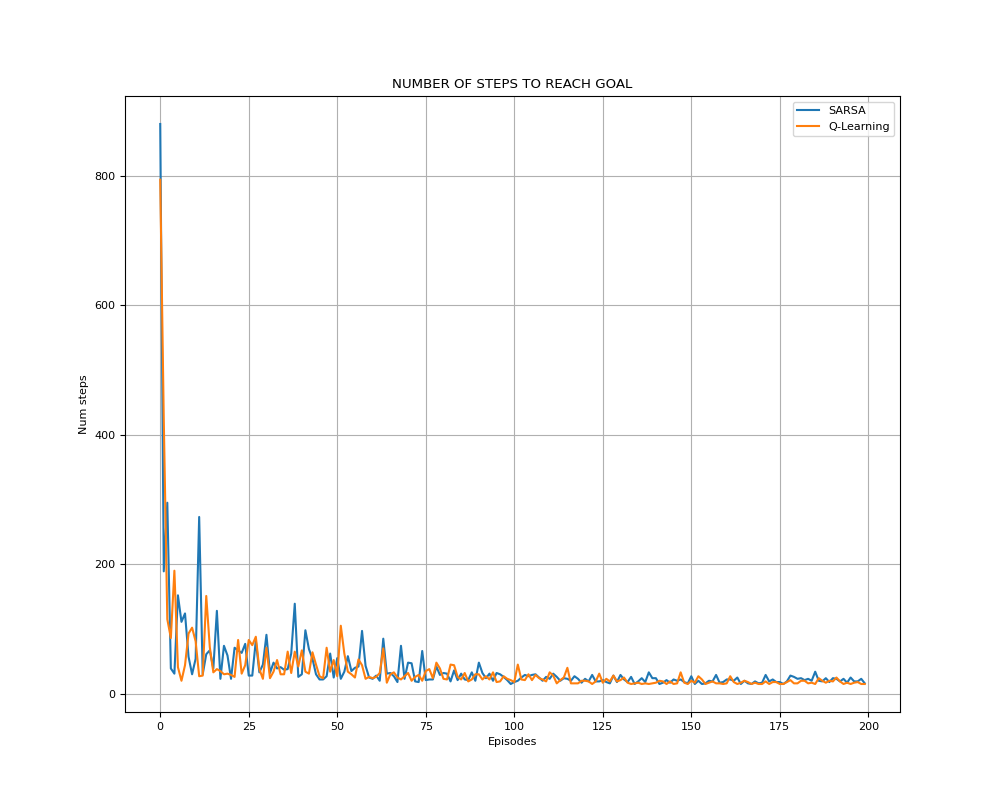

# WINDY-GRID-WORLD
- Using SARSA/Q-Learning to solve the Control Problem:
    - Estimate optimal Q.
    - Estimate optimal policies based on estimated Q.

## Examples
- SARSA with 200 episodes:

- Q-Learning with 200 episodes:

- Comparison between SARSA and Q-Learning with 200 episodes:

