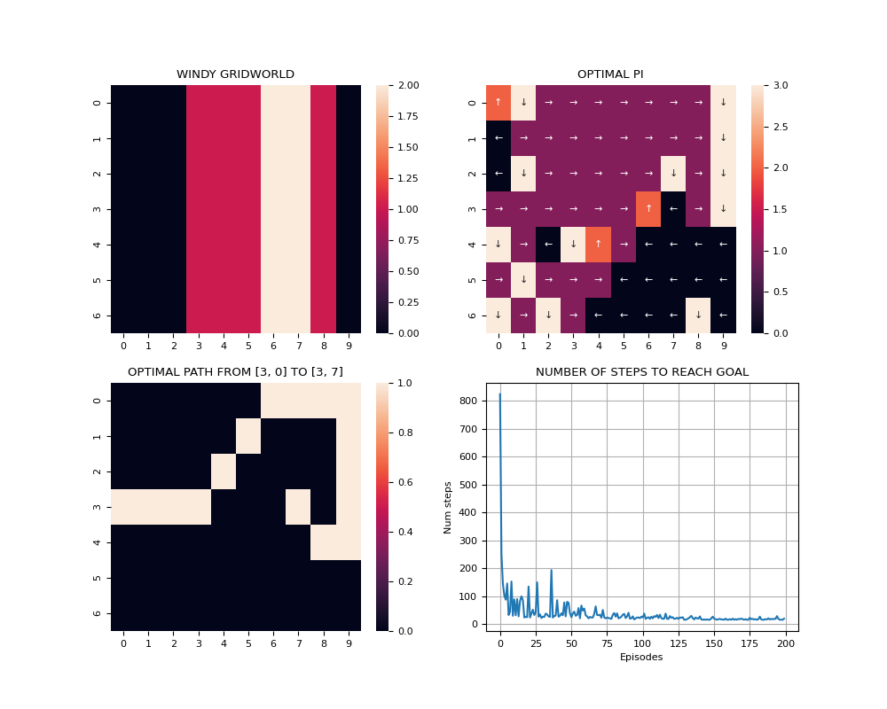

# WINDY-GRID-WORLD
- Using _SARSA_/_Q-Learning_ to solve the **Control Problem**:
    - Estimate optimal Q.
    - Estimate optimal policies based on estimated Q.

## Examples
- _SARSA_ with 200 episodes:

- _Q-Learning_ with 200 episodes:

- Comparison between _SARSA_ and _Q-Learning_ with 200 episodes:

